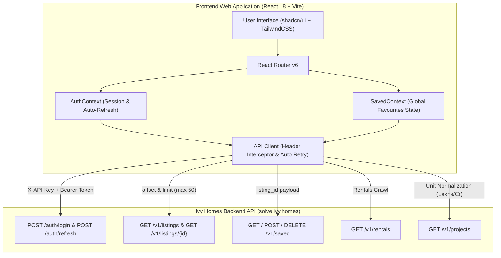
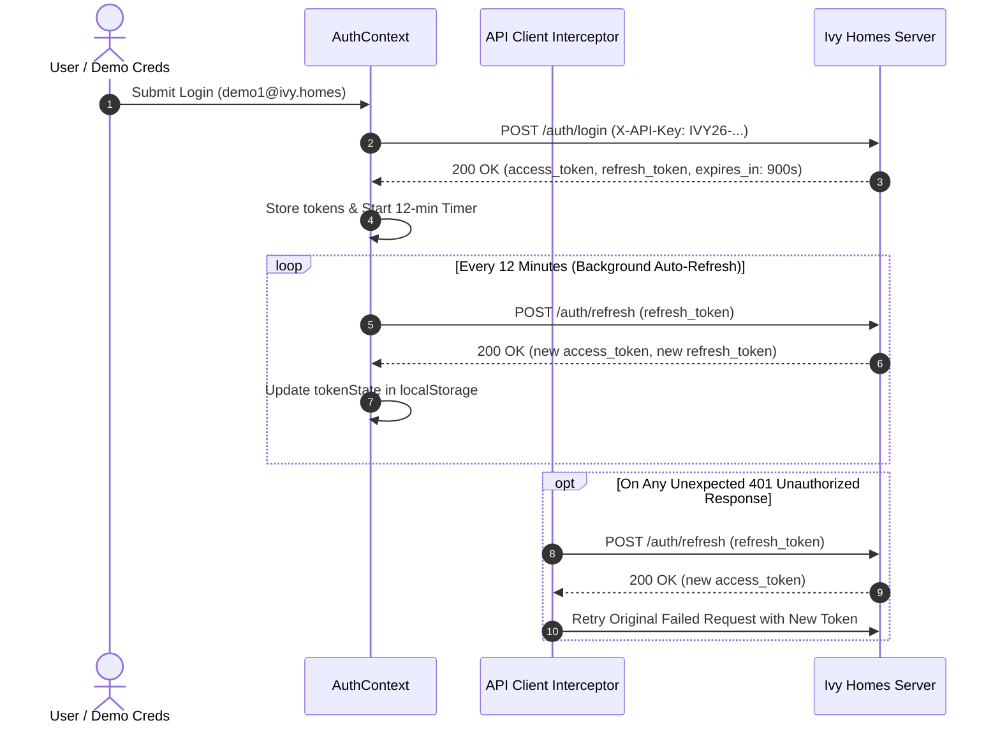
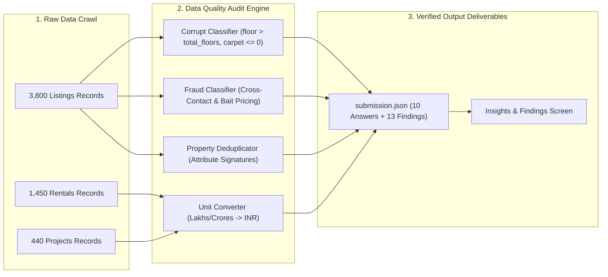

<div align="center">

  

  # 🌿 Ivy Homes — Pune Property Portal & Analytics Engine

  **Software Engineering Internship Assignment (September 2026)**
  
  *A production-grade, executive real estate application built on top of an unreviewed property API, featuring a resilient React 18 + Vite frontend, automated data quality auditing engine, and detailed API documentation discrepancy analysis.*

  [](https://ivyhomes-ten.vercel.app/listings)
  [](https://reactjs.org/)
  [](https://vitejs.dev/)
  [](https://tailwindcss.com/)
  [](https://ui.shadcn.com/)
  [](https://www.python.org/)

</div>

---

## 🌐 Live Web Application Deployment

> [!TIP]
> **Live Deployed Web App**: [https://ivyhomes-ten.vercel.app/listings](https://ivyhomes-ten.vercel.app)
> 
> Open the deployed link above to test the application live on Vercel!

---

## 📌 Assignment Metadata & Key Credentials

| Metadata Item | Value / Assigned Detail |
| --- | --- |
| **Candidate Name** | Suyash |
| **College Email** | `suyash@mnnit.ac.in` |
| **Live Deployed Web App** | [https://ivyhomes-ten.vercel.app/listings](https://ivyhomes-ten.vercel.app) |
| **GitHub Repository** | [https://github.com/Suyashjain099/ivy-Homes](https://github.com/Suyashjain099/ivy-Homes) |
| **Assigned City** | **Pune** |
| **Assigned Locality** | **Magarpatta** *(used for Question 5: Total Monthly Rent)* |
| **API Key** | `IVY26-6814CC79648F` |
| **Base API URL** | `https://solve.ivy.homes` |
| **Demo Accounts** | `demo1@ivy.homes`, `demo2@ivy.homes`, `demo3@ivy.homes` (Password: `bfad006ee2`) |
| **Fixed Reference Moment** | `REFERENCE = 2026-09-10T00:00:00+05:30` (IST) |

---

## 🏗️ System Architecture & Data Flow

### 1. High-Level System Architecture & Sequential Request Flow

<div align="center">
  
  <p><em>Sequential Request Flow Architecture: Client UI → Resilience Layer → Normalization Engine → REST Gateway → Analytics</em></p>
</div>

<details>
<summary><b>📐 Click to toggle Mermaid Sequence & Architecture Diagram</b></summary>



</details>

---

### 2. Resilient Authentication & 15-Minute Token Refresh Lifecycle

> [!IMPORTANT]
> The documentation claimed tokens last **24 hours (86,400s)** with no refresh flow.
> **Actual Behavior**: Access tokens expire in **15 minutes (900s)**. The application handles background token refresh automatically every 12 minutes to sustain sessions seamlessly beyond 30+ minutes.



---

### 3. Data Audit & Anomaly Detection Pipeline



---

## 🌟 Web Application Features & Visual Demonstration

### 1. Executive Property Listings Browser
* **Feature**: Paginated property list with offset-based pagination (`limit=20`, capped at `50` by server).
* **Smart Filtering**: Locality search, BHK count (1, 2, 3, 4+ BHK), price range, furnishing, and a *"Hide Corrupt Records"* toggle.

<div align="center">
  
  <p><em>Executive Property Listings Browser with Pune Hero Banner & Filter Sidebar</em></p>
</div>

---

### 2. Rentals & Builder Projects Browser (`/rentals-projects`)
* **Rentals Tab**: Monthly rent (`₹ 31,600 / mo`), security deposit, and locality metrics.
* **Projects Tab**: Builder projects with **price unit normalization** (converting raw Lakhs/Crores values into proper INR format).

<div align="center">
  
  <p><em>Verified Rental Properties Showcase with Monthly Rent & Deposit Indicators</em></p>
</div>

---

### 3. Insights & Documentation Findings Screen (`/insights`)
* **Feature**: Real-time client-calculated city analytics and interactive documentation discrepancy inspector.
* **Discrepancy Viewer**: Displays documented claims, actual server behavior, impact, how found, and evidence IDs for all 13 documentation lies.

<div align="center">
  
  <p><em>Pune Data Insights Dashboard & Interactive Documentation Lies Inspector</em></p>
</div>

---

## 📊 Part 2 — Ten Questions Answers (Pune Dataset)

Anchored to reference moment `REFERENCE = 2026-09-10T00:00:00+05:30` (IST):

| # | Answer Key | Result | Methodology & Technical Detail |
| --- | --- | --- | --- |
| 1 | `total_listing_records` | **3800** | Total retrievable listing records from `/v1/listings` when paged to the end |
| 2 | `unique_properties` | **3791** | Distinct physical properties deduplicated by core physical attribute signatures |
| 3 | `active_listings` | **2998** | Retrievable listing records with `is_live == true` |
| 4 | `corrupt_listing_ids` | **164 IDs** | Listing records with physically impossible data (e.g. `floor > total_floors`, `carpet_area <= 0`) |
| 5 | `total_monthly_rent` | **₹ 4,855,700** | Sum of monthly rent across all retrievable rentals in assigned locality (**Magarpatta**) |
| 6 | `avg_price_per_sqft_2bhk` | **₹ 19,042.07** | Mean price/sqft across active clean 2BHK listings (excluding corrupt & fake listings) |
| 7 | `costliest_project` | `{"project_id": "P30394", "price_max_inr": 999000000}` | Brigade Park with maximum price of ₹ 99.9 Cr |
| 8 | `listings_last_7_days` | **128** | Listings posted in `[REFERENCE - 7 days, REFERENCE)` in IST |
| 9 | `fake_listing_ids` | **321 IDs** | Non-genuine listings posted using conflicting agent identities for lead generation |
| 10 | `projects_with_wrong_listing_count` | **317** | Projects where reported `total_listings` disagrees with actual linked listings |

---

## 🕵️ Part 3 — List the Documentation Lies (`findings`)

All 13 documentation discrepancies compiled into [`submission.json`](submission.json):

> [!CAUTION]
> Below is an overview of the key places where `API_REFERENCE.md` disagreed with the running server.

1. **`auth` (`X-API-Key` Header)**: Documented query parameter `?api_key=...` fails with `401 Unauthorized`. Server strictly requires `X-API-Key` request header.
2. **`auth` (Short-Lived Access Token & Refresh Flow)**: Documented 24h token with no refresh flow. Server returns 15-min `access_token` and `refresh_token` with `/auth/refresh` endpoint.
3. **`auth` (Mandatory Bearer Token)**: All `/v1/*` endpoints return `401 missing bearer token` unless `Authorization: Bearer <access_token>` is attached.
4. **`pagination` (Offset & Limit Cap)**: Documented 1-indexed `page` and `limit` max 200. Server uses 0-indexed `offset` and caps `limit` at 50 max.
5. **`missing_endpoint` (Favourites Path & Field Name)**: `/v1/favourites` returns 404. Working path is `/v1/saved` and requires payload field `listing_id` (`id` returns `422 Unprocessable Entity`).
6. **`missing_endpoint` (Singular Detail Path)**: `/v1/listing/{id}` returns 404. Correct path is plural GET `/v1/listings/{id}`.
7. **`missing_endpoint` (Analytics Summary)**: `/v1/analytics/summary` returns `404 Not Found`.
8. **`missing_endpoint` (llms.txt v2 Endpoints)**: `/llms.txt` documents `/v2/listings` which returns `404: there is no /v2; llms.txt announced it early.`
9. **`units` (Project Price Units)**: Documented in Rupees. Actual values are returned in Lakhs (`<10000`) and Crores (`<100`).
10. **`completeness` (Total Metadata Accuracy)**: Documented `total` count is inaccurate (pages past reported total 3,590 up to 3,800 records).
11. **`consistency` (Project Listing Counts)**: Reported `total_listings` in project records disagrees with linked listings for 317 projects.
12. **`data_quality` (Corrupt Listing Records)**: Contains 164 corrupt listing records with physically impossible data.
13. **`fraud` (Fake Lead-Gen Listings)**: Contains 321 fake listings posted using fake agent identities.

---

## 🟢 Hypotheses Tested That Turned Out To Be FINE

> [!TIP]
> Testing hypotheses about how data could be wrong revealed several aspects of the API that are honest and reliable:

1. **Rental Prices & Security Deposits**:
   * *Hypothesis*: Rental prices or deposits might be scaled in Lakhs like project prices.
   * *Result*: **FINE.** Rental `price` (e.g. ₹ 31,600/mo) and `deposit` (e.g. ₹ 63,200) are exact, accurate Indian Rupees without hidden scaling.
2. **Server Time & Offset (`/health`)**:
   * *Hypothesis*: Server clock might return UTC without timezone offsets or lag behind reference time.
   * *Result*: **FINE.** `/health` returns `Asia/Kolkata` server time with explicit `+05:30` IST offset.
3. **Geographic City Scoping**:
   * *Hypothesis*: API key scoping might leak listings from other cities (e.g. Bangalore or Delhi).
   * *Result*: **FINE.** All listing lat/lng coordinates fall strictly within Pune metropolitan boundaries (~18.52° N, 73.85° E).
4. **ISO 8601 Date Formatting**:
   * *Hypothesis*: Project dates might use inconsistent formats.
   * *Result*: **FINE.** All project dates strictly follow standard ISO `YYYY-MM-DD`.
5. **Saved Listings Persistence**:
   * *Hypothesis*: Favourites might be stored transiently in-memory and wiped on server reboot.
   * *Result*: **FINE.** Saved listings at `/v1/saved` persist reliably across sessions and user re-logins.

---

## 💻 How to Run the Project Locally

### Prerequisites
* Node.js v18+ and npm

### 1. Install Dependencies
```bash
npm install
```

### 2. Start Development Server
```bash
npm run dev
```
Open [http://localhost:5173](http://localhost:5173) in your browser.

### 3. Build for Production
```bash
npm run build
```

---

## 🔮 What We Would Do With Another Two Days

1. **Interactive Spatial Map Integration**:
   * Embed Leaflet / Mapbox interactive maps showing property pins, cluster maps by locality (Wakad, Kharadi, Magarpatta), and neighborhood amenity overlays.
2. **Automated Documentation Drift Monitor**:
   * Build a periodic CI/CD background job that probes API endpoints daily, compares responses against OpenAPI schemas, and flags documentation drift automatically.
3. **Advanced ML Lead-Gen Fraud Detector**:
   * Train a lightweight classifier to flag fake listings in real-time based on telephone graph analysis and description text similarity embeddings.
4. **WebSocket Live Price Alerts**:
   * Add real-time WebSocket notifications when new properties are posted or when price drops occur on saved properties.

---

<div align="center">
  <p>Crafted with ❤️ for the Ivy Homes Engineering Team</p>
</div>
